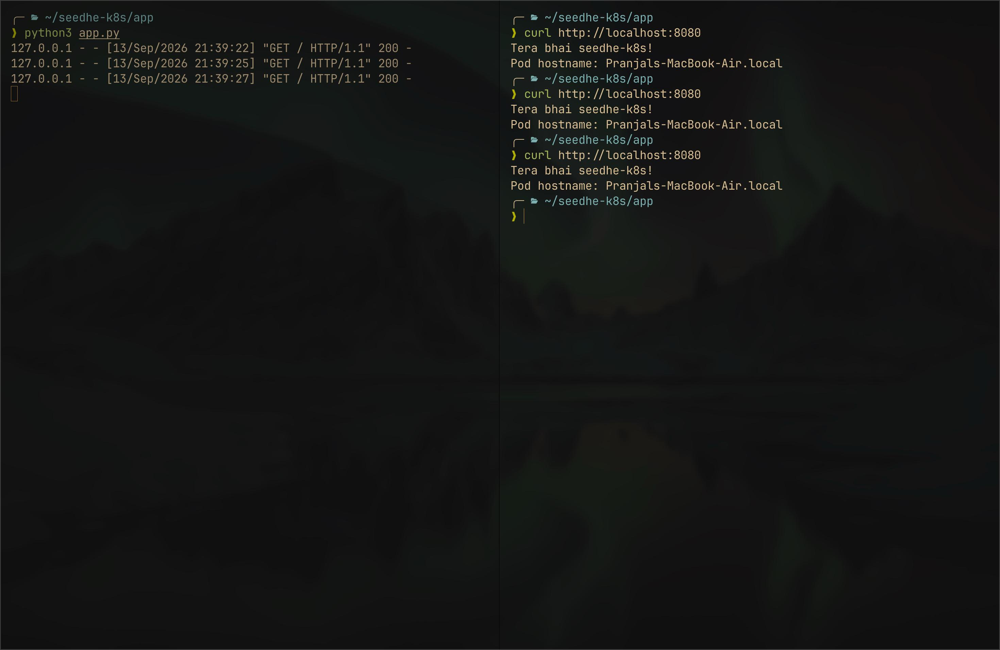
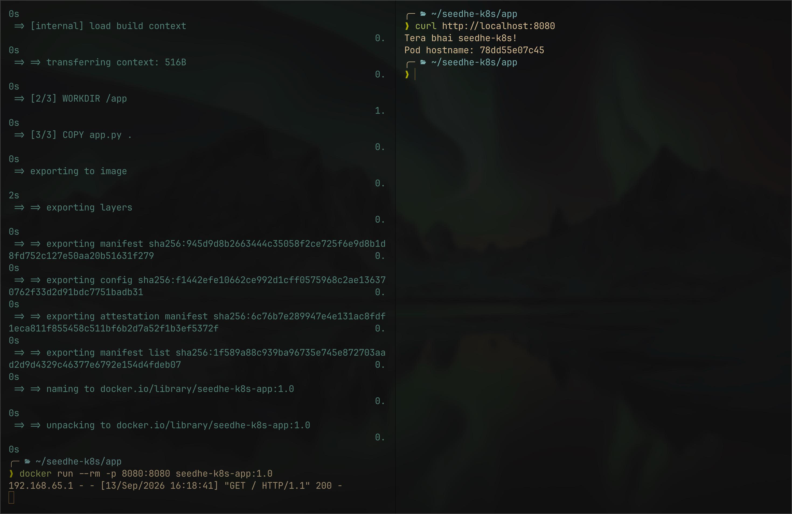

# Tera bhai 'seedhe-k8s'

(was listening to SeedheMaut while I was working on this)

I wanted to understand Kubernetes practically instead of just knowing the theory, so I made this project step by step.

I started with 3 VMs. One acts as the control-plane and the other two act as data-plane/workers. First I prepared all 3 VMs with the common Kubernetes dependencies like kubeadm, kubelet, kubectl, the container runtime and the networking dependencies needed for the cluster.

After that I used `kubeadm init` on the control-plane. Here I had to give the control-plane IP and the CIDR range which would be used for the Pods. Then I used the generated `kubeadm join` command on the other two VMs to connect them to the control-plane.

This is where I understood the basic difference between the control-plane and the worker nodes. The control-plane has the kube-apiserver, etcd, kube-scheduler and kube-controller-manager, while the worker nodes are where the actual application Pods run. The kubelet runs on every node and is responsible for managing Pods on that node, while kubectl is just the CLI I use to talk to the Kubernetes API.

After `kubeadm init`, the cluster still needs a Pod network. This is where I learned about CNI (Container Network Interface) and CIDR properly. The CIDR I gave during `kubeadm init` is the address range reserved for Pods, while the CNI is what actually sets up the networking for those Pods so they can communicate with each other across the nodes. I used Flannel as the CNI in this project.

This also helped me understand the CoreDNS thing. CoreDNS itself runs as Pods, so before the Pod network is configured it cannot properly communicate inside the cluster. That is why after the initial kubeadm setup CoreDNS can stay Pending until the CNI is installed.

Once the cluster part was done, I made a very small Python HTTP application. I tested it directly on my Mac first and then put the same app inside a Docker container. I built the image, tested the container locally and pushed the image to Docker Hub so that the Kubernetes nodes can pull the same image later.

After that I created a Deployment with 3 replicas. This is where I understood the flow of Deployment -> ReplicaSet -> Pods properly. I don't decide which worker node should run which Pod manually. I declare that I want 3 replicas and the scheduler decides where the Pods should run. The kubelet on the selected node then works with the container runtime to actually run the Pod.

Then I added a Service. The main reason for this was that Pod IPs are not something I should depend on because Pods can be recreated and their IPs can change. The Service gives me a stable endpoint and selects the Pods using their labels. I used a ClusterIP Service here, so it stays inside the cluster for now.

After the Service I added an Ingress. The Ingress is basically the routing rules for HTTP/HTTPS traffic to my Service. I also understood that an Ingress object by itself does not actually handle the traffic, an Ingress Controller has to implement those rules. I still kept this step in the project because I wanted to understand the Ingress model properly.

After understanding Ingress I moved to Gateway API. Here the main thing I learned was that Gateway API splits the traffic setup into different resources instead of putting everything into one Ingress object. GatewayClass represents the implementation/controller, Gateway represents the actual entry point and listeners, and HTTPRoute contains the HTTP routing rules which finally point to the Service. For this project I used Envoy Gateway as the implementation. My Deployment and Service did not need to change because this layer is still sitting in front of the same Service.

## QUESTION :)

One thing I wanted to understand separately was what happens if all the nodes are not in the same private network.

Right now my setup is simple because the control-plane and both workers are in the same private network. For example the control-plane could be `192.168.1.10`, Worker 1 could be `192.168.1.11` and Worker 2 could be `192.168.1.12`. In that case the workers can directly reach the Kubernetes API server on the control-plane at `192.168.1.10:6443`.

But if one worker is somewhere else and has a public IP, it cannot directly reach the control-plane's `192.168.1.10` private IP because that address is only reachable inside that private network.

What I thought of here was either allowing/forwarding the required traffic through the router/firewall, or making a VPN between the networks so that the machines can communicate with each other privately. I also came across Tailscale and this seemed like a simple way to create that private connection between the nodes.

For example, the control-plane could still have `192.168.1.10` as its normal private IP, but also have a Tailscale IP like `100.x.x.10`. Worker 1 could have `100.x.x.11` and Worker 2 could have `100.x.x.12` even if Worker 2 is on a different network. The nodes can then use the Tailscale network to reach each other.

Tailscale is only solving the node-to-node connectivity part here. It is not replacing the Kubernetes CNI. CNI is still the thing that provides the Pod network inside the Kubernetes cluster.

If I actually build the cluster this way, I also cannot just keep the old `kubeadm init` setup and expect everything to work. Earlier I would initialize the control-plane using its private IP. With the Tailscale setup, I would need to configure the Kubernetes API server and node networking around the address the other nodes can actually reach, and the workers would use that reachable control-plane endpoint when joining the cluster.

