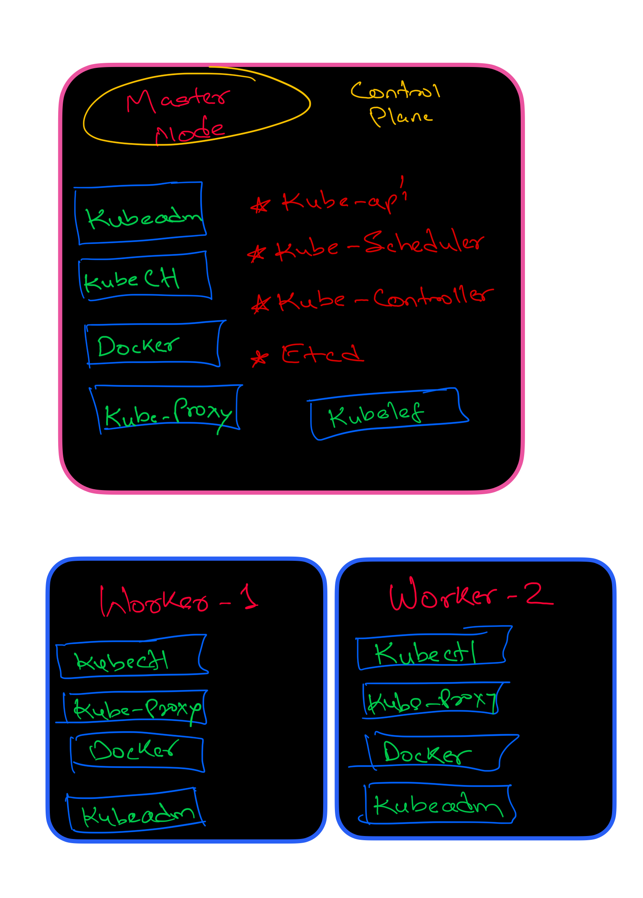

## Welcome to `seedhe-k8s`
*(was listening to SeedheMaut while I was working on this)*

Here I made 3 VMs and wanted to make sure one acts as the **control-plane** while the other two act as **data-planes/workers**.

`scripts/all-vm-installation.sh` is the first and basic command to run in all 3 VMs. It prepares all the VMs with the common binaries, container runtime and other dependencies needed for Kubernetes.



After applying this, all the VMs are in the same state. Now it is time to make one of them the **control-plane**, so we execute:

`scripts/init-control-plane.sh`

Here we basically do `kubeadm init` and give the **control-plane IP** and the **CIDR range that will be used for Pods**.

Now we go for the next script, `scripts/join-workers-to-control-plane.sh`. Here we connect the other 2 worker nodes to the control-plane node we have chosen.

Currently all of them are in the same private network, so this works directly because the worker nodes can reach the control-plane API server.

But after this, when you do:

```bash
k get nodes
```

or

```bash
k get pods -A
```

you will see that **CoreDNS will not be in the Running/Ready state**. It won't come up until we configure the **CNI (Container Network Interface)**.

CoreDNS in Kubernetes is a **Pod**, and it needs the Pod network to communicate with other Pods and resources in the cluster. So we have to make sure that Pod networking is configured through the CNI. I used **Flannel** here to configure this.

`scripts/install-cni.sh` takes care of this and solves the problem. After running this, when we again do:

```bash
k get nodes
```

and

```bash
k get pods -A
```

the nodes should be **Ready** and CoreDNS should be up and running.

Now if you do:

```bash
k get nodes
```

you will see both worker nodes, but their `ROLES` will show as `<none>`. To make it clear that these are worker nodes, we run:

`scripts/worker-label.sh`

This adds the worker label to both nodes, so `k get nodes` will show `worker` under `ROLES`. This does **not** affect the actual working or functionality of the nodes; it is just a Kubernetes label.

And now we have successfully made a **3-node Kubernetes cluster**, with one node acting as the **control-plane** and the other two acting as **data-plane/worker nodes**.

```

